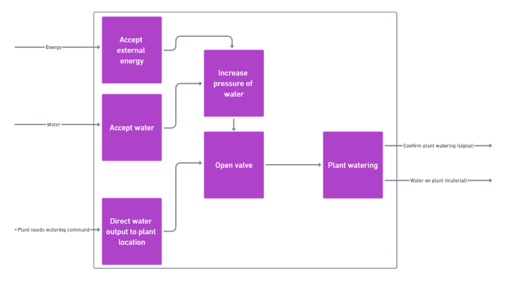
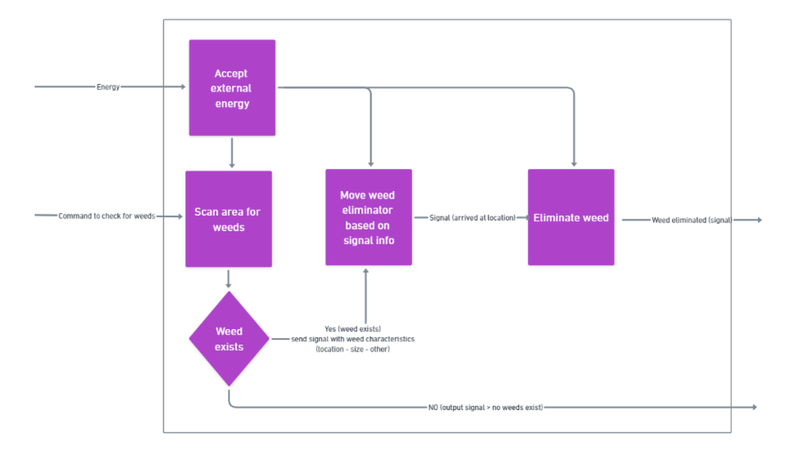
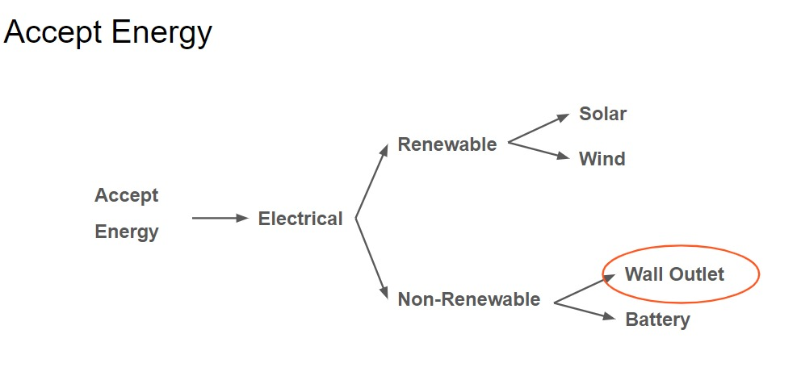
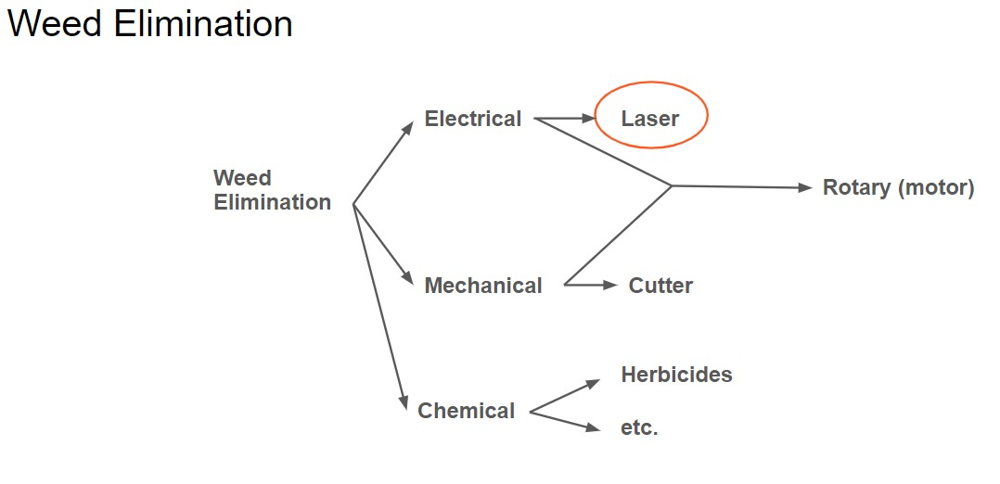
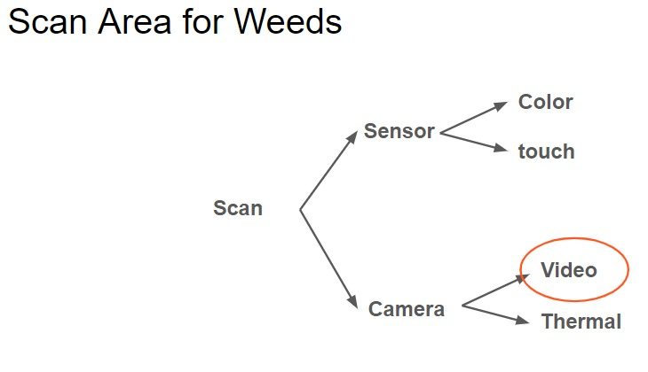
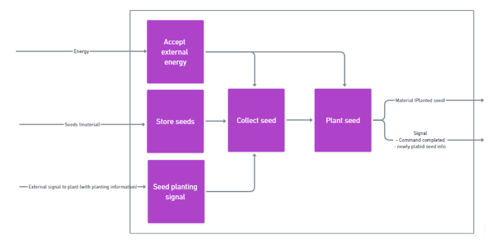
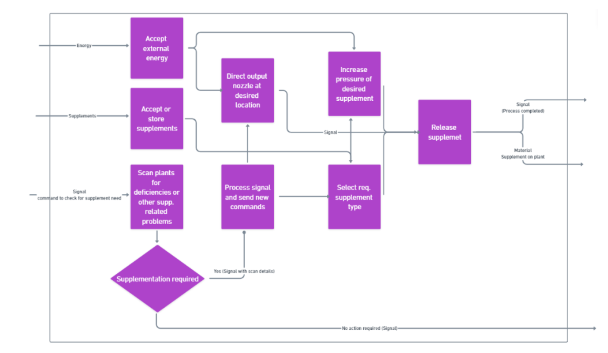
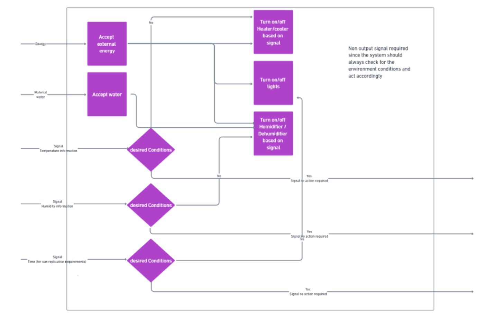
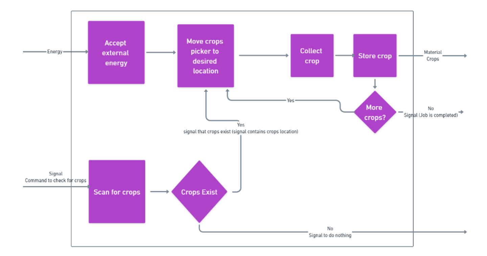

### Watering

This diagram illustrates the function decomposition for automatic plant watering. Three system inputs are required: energy in the form of electrical power, water in the form of a fluid, and a command informing the system that it is time to water the plants. The system has two outputs: water to be released on the plants and a signal confirming the plant watering process. When the energy input is accepted as external energy and used to increase the water pressure, the water input is accepted by the system, and the command indicating the plant's needs is accepted, the watering process is initiated.
The system will accept the water input and use the energy input to increase the pressure of the water, which will then wait at the end of a valve for the watering input command to release the water flow and accomplish the objective of watering the plants, triggering the output.
### Weeding

The figure above illustrates the functional decomposition required for weeding. After receiving the command to check for weeds, the system uses electrical energy to scan the area and, if a weed is detected, the system moves the weeder in accordance with the weed's location and size. After that, the weeder will begin eradicating the weed and will signal when it is complete. In contrast, if the area is scanned and no weeds are detected, the system will transmit a signal indicating that no weeds were detected.
The weeding functional decomposition helped with choosing the mechanisms and techniques of the subsystems as follow:

The figure above shows the classification tree for accepting the external energy. Answering the following questions were useful to choose the techniques:
- What kind of energy need to be saved?
- Is it a renewable power source or it doesn’t matter?
- What kind of power source?
Results in choosing the wall outlet which is a non-renewable power source for electrical energy.

The figure above shows the classification tree for weed elimination. Answering the following questions was useful to choose the techniques:
- What are the techniques that can be used? Is it a combination of more than one?
- What tools can be used for each technique?
Result in choosing a laser which is an electrical tool capable of burning the weeds.

The figure above shows the classification tree for the area scanning techniques Answering the following questions were useful to choose the techniques:
- What kind of scanner needs to be used?
- What kind of scanning tool?
- How does the scanning tool work?
Result in choosing a regular video camera to scan the planting area and looks for weeds.
### Seed Planting

This figure shows the functional decomposition for seed planting. The system has three inputs: energy in the form of electrical power to supply the system with the necessary power to perform the tasks, The seeds are used as the planting material, and a command is used to inform the system about the plants. The system has two outputs: the seed as the material pushed beneath the soil at the proper depth and a signal informing the system of the planting's completion and information. When external energy is accepted and used to power the seed collection and planting mechanisms, seeds are stored and planted, and the planting command is accepted to initiate the planting process, the inputs and outputs interact.
### Supplement System

This figure shows the functional breakdown of the supplement system. The system will begin by scanning for deficiencies in the plants and storing the necessary supplements. The system will then send a signal indicating the location and type of supplement required if a deficiency is detected in a plant. Following that, it will direct the nozzle to the desired location and increase the supplement's pressure using electrical energy. This process results in the release of the supplement onto the plant, along with a signal indicating its presence. If no deficiency is detected, the system will send a signal indicating that the plant did not require additional nutrients.
### Climate Control

This is figure illustrates the functional decomposition for the climate control system. The system has five inputs: energy in the form of electrical power, water as the fluid, and three signals that inform the system about the temperature, humidity, and time. The system produces no outputs because it is constantly monitoring the climate conditions. The system is designed to accept ally electrical energy, and distribute it to the conditioning devices. Accept the water and use it to humidify or dehumidify the surrounding environment. The system will determine whether the current climate conditions are desirable or not and will turn on/off the conditioning devices accordingly.
### Harvesting

This is the harvesting system's functional decomposition. The system will begin scanning the area immediately for crops that require harvesting. If crops are detected, the system transmits a signal to the picker indicating their location, which the picker then moves to using electrical energy. The picker will then collect the crops and determine if additional crops need to be harvested or stored. If, on the other hand, the system detects that the crops are still growing, it will send a signal indicating that no further action is required.
