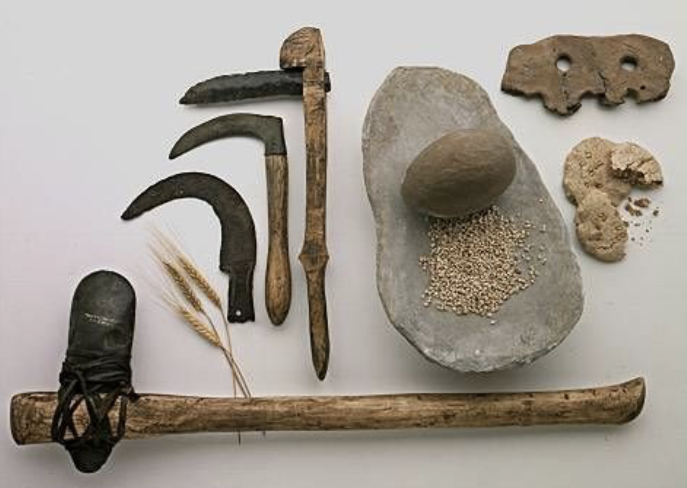
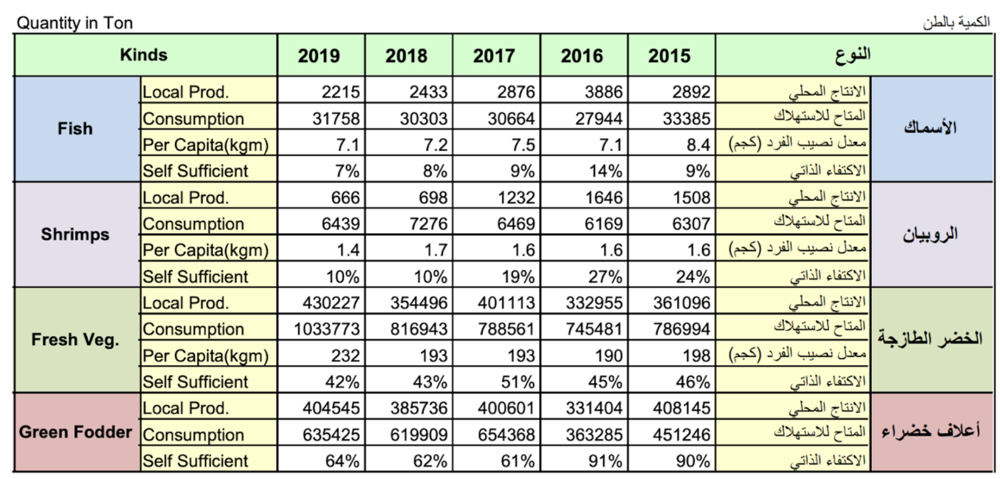

# Abstract

Automated farming was targeted for the roots in has in sustainability and self-sufficient systems, the numbers have shown that self-sufficiency in agriculture is a problem worth solving in Kuwait and the world. Awareness is increasing and it’s driving the demand for sustainable solutions which was validated with market research. A collaboration with a company that builds autonomous agricultural robots, Farmbot, forms the base for this project where the feasibility of the product is studied for the region showing promising results of break-even period less than 3 years for the worst case. The weeding mechanism was switched from motors to efficient lasers with no moving components, which eliminated unwanted vibrations and power draws. The laser was evaluated by developing a totally separate weed detection and elimination method in MATLAB using smart vision systems and a 3D printer assembly. Components required for the Farmbot upgrade were designed, and prototypes were built and tested to confirm that the expected outcomes were achieved.

## Introduction
Agriculture, alternatively referred to as farming, is the process of growing and harvesting plants and animals in order to produce food, fiber, and animal feed. Numerous agricultural products are utilized on a daily basis, from clothes to bed sheets. Agriculture can be summrized into five words: farming, food, fabric, flowers, and forestry. The origins of agriculture can be traced all the way back to the Fertile Crescent, a region in the Middle East. This region encompasses the modern states of Syria, Lebanon, Palestine, Jordan, Egypt, Cyprus, Turkey, and Iran, as well as the northern region of Kuwait. Agriculture began in the Neolithic era, approximately 10000 BCE and tools were made of stone.

Agriculture continued to evolve during which new methods and tools for cultivating crops were developed, including crop rotation, mechanical harvesters, steam-powered tractors, and gasoline-powered tractors. Another agricultural boom occurred in the 20th century, specifically in agriculture chemistry, which includes the application of chemical fertilizer, chemical insecticides, and soil composition. Agricultural development is one of the most effective strategies for eradicating extreme poverty and feeding the growing population. Agriculture is also critical for economic growth, accounting for 4% of global gross domestic product (GDP) in 2018. [2]
Kuwait faces three major challenges in agriculture: first, harsh climate conditions due to the country's dry climate and long, hot summers; second, limited natural water resources; and third, limited agricultural land due to 90 % of land being unsuitable for farming. Kuwait has a lowreliance on subsistence agriculture. Additionally, Kuwait faces a high risk of food insecurity as a result of its lack of self-sufficiency and reliance on imported food, as Kuwait's crop production is limited and primarily consists of grain, potato, and vegetables. In order to tackle this problem Kuwait's Vision 2035 includes a goal of achieving food security by 2035 through sustainable agriculture and encouraging the private sector and foreign companies to invest in new agriculture technologies. As a result, Kuwait now has the largest indoor vertical farm in the Middle East, which was built by the german company &ever. [3]

The rapid change in the world and the realization of the scarcity of sustainability has skyrocketed the demand for sustainable, self-sufficient systems that humans can rely on to provide them with the most basic of needs and laying the first block of Maslow's hierarchy of needs which is the physiological needs block (air-water - food). This, combined with the high level of awareness and the appeal of high quality, non-GMO, and organic produce to most and if not all consumers. The team was confronted with this urge to develop a product that could satisfy a small portion of the above idea while utilizing their engineering skills. In this project, the team will thoroughly discuss the process from the day the seed was planted until the crops of hard work were harvested.

[This is the link](www.google.com)

This website is powered by no body [documentation](https://learn.netlify.app/en/) to learn how to use click on this
